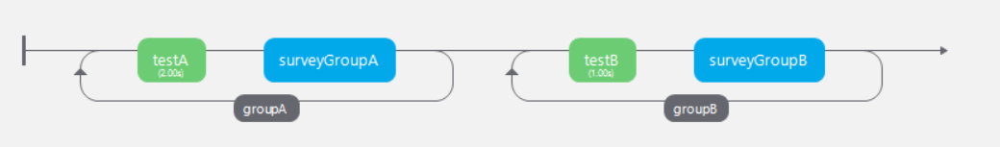
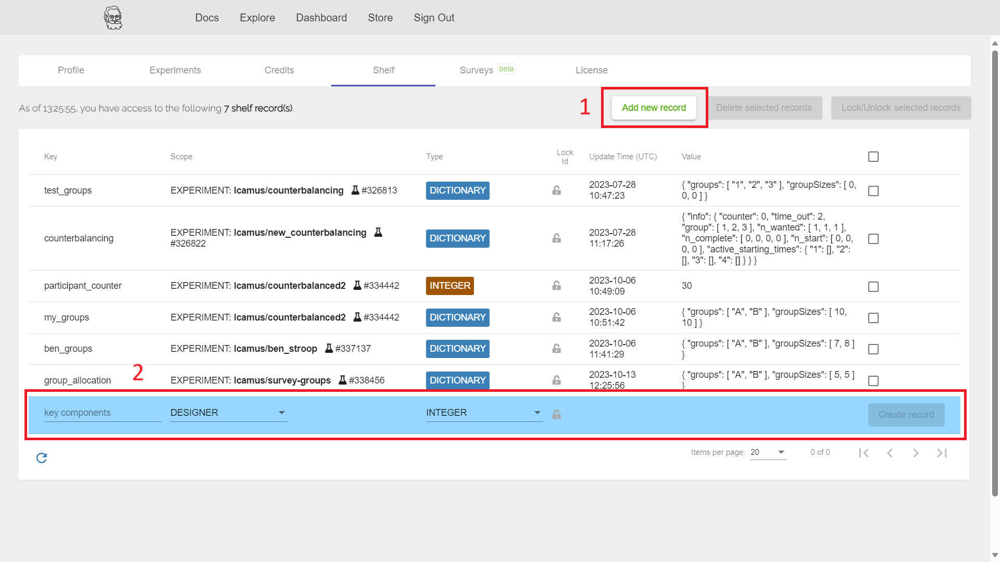
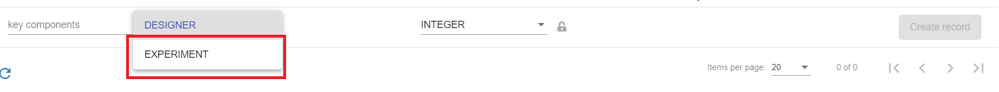
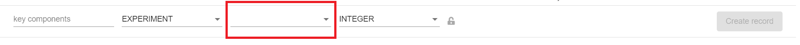
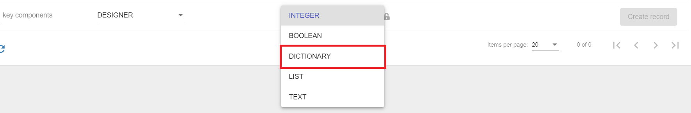
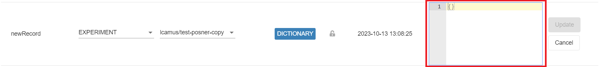
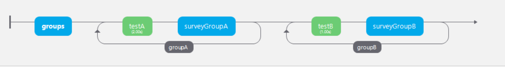
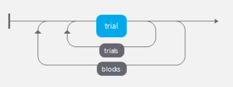
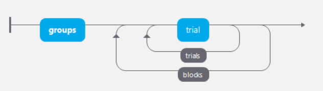

```{r setup, include=FALSE}
knitr::opts_chunk$set(echo = TRUE)
```

Welcome to the guidance documentation for using Pavlovia to create and run experiments online.

There is a table of contents on the left to help you navigate this guide and its main sections.
Clicking on a section in the table will take you to the section and display subheadings within this section.

Please be aware this is a live document and is subject to change as I expand the guidance.

# Create an account {#account}

If you wish to use Pavlovia to create a survey or put an experiment online, please contact me at [lcamus@qmu.ac.uk](mailto:lcamus@qmu.ac.uk) if you haven't already to get set up.

I will create an account for you and send you the link for [resetting your password](https://gitlab.pavlovia.org/users/password/new).
You will then be able to login and get started.

<!-- You will first need to create an account with Pavlovia. To do so, please go to the [Pavlovia sign up page](https://gitlab.pavlovia.org/users/sign_in) and click on the Register tab. -->

<!-- Make sure you follow the steps below so that you are covered by the QMU Pavlovia license, which enables you to collect data for free. -->

<!-- Enter: -->

<!-- * your full name -->
<!-- * a username -- use the first half of your QMU email address (example jsmith1 if you are a member of staff, or your student number if you are a student) -->
<!-- * your QMU email address -->
<!-- * a strong password consisting of upper and lower case letters, numbers and special symbols -- make sure this is secure as your studies and data will be accessible through this account. -->

Please note that unlike Qualtrics, I do not have control over your login credentials, and will not be able to help with issues regarding forgotten login credentials.
Should you forget your password, the Sign in page has a "Forgot your password?" link for you to set a new password.

When you first log in, there is a chance you will land on the GitLab end of Pavlovia, which is not where you will be able to create and manage your surveys and online experiments.
Check the website link, if it starts with https://gitlab.pavlovia.org/ you are not in the right place.
Instead, make sure you go to https://pavlovia.org/dashboard.

# Online experiments {#experi}
<!-- PsychoPy introduction text... -->

The survey builder is not Pavlovia's only function.
You can also host your PsychoPy experiments on the platform to collect data online.
PsychoPy is a free package allowing you to create and run a variety of experiments, and with Pavlovia you can take those experiments out of the lab and online.

Below are resources to get you started with PsychoPy, and to help you to sync and integrate those experiments with Pavlovia for online data collection.

<!-- Each section below covers different aspects of online experiments - it is recommended you read all of them in detail for best results. -->

## Experiment creation {#expCreat}

PsychoPy has extensive features to allow you to create a range of experiments.
You can find support for creating experiments in PsychoPy on their [website](https://www.psychopy.org/documentation.html) and on [YouTube](https://www.youtube.com/@PsychoPy_official/videos).

When creating an experiment to put online, you will need to make sure the features you use (and any code you may include) are suitable to online porting.
One way to ensure this is to filter the PsychoPy components to those that are available online.
To do this, find the funnel icon in the Components bar on the right-hand side of PsychoPy, and choose the "PsychoJS (online)" option - this will show you only the components that are compatible with putting experiments online.

The guidance below assumes some basic knowledge of PsychoPy and experiment set up.
If you've never created an experiment in PsychoPy before, try following [this tutorial](https://www.youtube.com/watch?v=fIw1e1GqroQ) by PsychoPy on how to create a Posner task.
The specifics of the task are not important, the tutorial just gives you a chance to create an experiment from scratch and to get to know the software better.
At the time of writing, the link to the supporting materials to create the task is broken, but by following the video you should be able to recreate the spreadsheet used in the task, and you can find replacement images for the task online.

If you want more practice, you can follow the tutorials available on the [PsychoPy website](https://psychopy.org/tutorials/index.html).

## Putting the experiment online

Once your experiment is ready, you can push it online to Pavlovia from the PsychoPy software.
Instructions on how to do so can be found here: https://www.psychopy.org/online/fromBuilder.html

Make sure you follow the instructions for pushing the experiment online via their sync function.
You may notice the icons look different - the globe and green sync icon (number 2 in the picture on the website) are inversed, so the green sync icon is large and the globe is small.
Use this button to sync your experiment with Pavlovia.

Once the experiment has synced, you will be able to find it in your Pavlovia Dashboard, under Experiments.

<!-- ## Adding collaborators -->

## Running the experiment

<!-- ### Approval documents -->

### Experiment status
You can find more information about study status on the [Pavlovia website](https://pavlovia.org/docs/experiments/piloting-running).

This will run you through the different statuses: Inactive, Piloting, Running.
**Please be aware that no data will be collected in the Inactive and Piloting stages.**
If you want to collect data, set your experiment to Running.

This page also highlights how to get the study link, which you can share to recruit participants.

Finally, you will find guidance on how to download your data from Pavlovia at the end of the page.

## Group allocation and counterbalancing {#grouping}

In many cases, you may wish to display stimuli in different ways based on a participant's group.
You may want to show one set of stimuli to participants in group A and a different set to participants in group B; or you might want to show set A then set B to participants in group A, and set B then set A to participants in group B.

Below I will walk you through two examples: 

* the first explains how to create two loops within your experiment to show stimuli in loop 1 to group A and stimuli in loop 2 to group B. The groups can be allocated manually or automatically (we will allocate them automatically in this example).
* the second explains how to counterbalance your online experiment automatically so participants are allocated a group automatically and see stimuli in a different order based on their group.

You should already be familiar with how to create an Excel file with the conditions for your experiment.
If you aren't, please refer to the practice task mentioned [above](#expCreat).

### Conditional loop display {#loopDisplay}

In this example, we will go through how to display a loop to participants depending on what group they are allocated to.
There should be as many loops as groups (two in this example), and each loop should have different content based on what you wish to show to different groups.

Here, we will have a loop called ```groupA``` with routines relevant to group A, and a loop called ```groupB``` with routines relevant to groupB.
For this example, each loop will have one routine with a Text component and one survey routine.
There will also be one routine at the start which we will use to allocate groups to participants.

First, create your routines for all your groups, then create loops that go around the routines for each group (if you have 3 routines for group A and 3 routines for group B, create a loop around the group A routines and another loop around the group B routines).
The details of the loops don't matter for now, we will update those once we've set up the automatic group allocation.
You can change the ```nReps``` to 1 to limit the time it takes for you to test the experiment.

At this point the PsychoPy timeline should look like this:
``` {r, fig.cap = "PsychoPy timeline for conditional loop display", fig.alt = "A screenshot of the PsychoPy environment, showing the timeline for this experiment.", label = "10.1", echo = F}

```

For my experiment, the first loop goes around two routines for group A, and the second loop goes around two routines for group B.
Once you have confirmed the experiment is running without issues (it will run through everything currently), you can push it to Pavlovia, set it to Running, and test it works online too.

We will now create a Shelf record in Pavlovia which will allow us to assign participants to our groups randomly and automatically.
Navigate to the Shelf tab in Pavlovia (to the right of the Experiments tab), and click "Add new record" (box 1 below).
You will see a new record is added for you to edit (box 2 below).

``` {r, fig.cap = "Pavlovia Shelf records", fig.alt = "A screenshot of the Pavlovia Shelf tab, showing Shelf records.", label = "10.2", echo = F}

```

Name your record to something that makes sense to you, making sure not to add special characters or spaces (i.e. use only letters, numbers and underscores).
For this example, my record for this experiment is called ```group_allocation```.

Next, we need to assign the record to the experiment you just pushed to Pavlovia.
Click on DESIGNER to change this to EXPERIMENT.

``` {r, fig.cap = "New Pavlovia Shelf record", fig.alt = "A screenshot of the Pavlovia Shelf tab, showing how to make a new Shelf record.", label = "10.3", echo = F}

```

Then click the box to the right and select the experiment you just uploaded.

``` {r, fig.cap = "New Pavlovia Shelf record - assigning to an experiment", fig.alt = "A screenshot of the Pavlovia Shelf tab, showing how to assign a new Shelf record to an experiment.", label = "10.4", echo = F}

```

Now, change the type of the record by clicking on INTEGER and selecting DICTIONARY.

``` {r, fig.cap = "New Pavlovia Shelf record - assigning type", fig.alt = "A screenshot of the Pavlovia Shelf tab, showing how to assign the type of a new Shelf record.", label = "10.5", echo = F}

```

Finally, click on the "Create record" button to finish creating the record.
Now click on the record to update its content, and navigate to the text box in the "Value" column.

``` {r, fig.cap = "New Pavlovia Shelf record - updating value", fig.alt = "A screenshot of the Pavlovia Shelf tab, showing how to update the value of a new Shelf record.", label = "10.6", echo = F}

```

Delete the curly brackets in the box and paste the code below, then click the Update button:

```javascript
{
  "groups": [
    "A",
    "B"
  ],
  "groupSizes": [
    5,
    5
  ]
}
```

This sets two groups (A and B), with 5 slots in each group.
Once we integrate this into our PsychoPy experiment, participants will be allocated to one of two groups randomly until all slots have been taken.

Back in our PsychoPy experiment, we will now add a routine (called ```groups```) before everything else (and outside any loops), and add a Code component to this routine.
Change the code type to JS, navigate to the Begin Experiment tab, and paste the code below.

```javascript
//fetch the group from the shelf - this returns 2 things - the label of the group (accessed using thisGroup.group) and a boolean to indicate if sampling is complete (accessed using thisGroup.finished)
counterbal = await psychoJS.shelf.counterBalanceSelect({key: ['group_allocation']})

// https://www.psychopy.org/online/shelf.html#counterbalancing
```

This calls on the Shelf record we just made, so make sure the name in the square brackets (here it's ```'group_allocation'```) matches the name you gave your record.
Then navigate to the Begin Routine tab, and paste the code below.

```javascript
// save the group participants have been allocated to in final data file
group = counterbal.group;
psychoJS.experiment.addData("group", group);
```

This saves the group participants have been allocated to in the final data file.

The PsychoPy timeline now looks like this:
``` {r, fig.cap = "PsychoPy timeline for conditional loop display", fig.alt = "A screenshot of the PsychoPy environment, showing the timeline for this experiment, with the added 'groups' routine.", label = "10.7", echo = F}

```

We now need to add Code components within each loop to tell PsychoPy to show only the loop associated with the participant's group.
In your first routine of your group A loop, add a Code component, and move it to the top of that routine.
In the Code component, navigate to the Begin Experiment tab and paste the code below.
Note that if you want your loop to run more than once, you can change ```show_groupA = 1``` to the number of times you want to show your loop (e.g. ```show_groupA = 5``` if you want to repeat that loop 5 times).

```python
# this says that if the group allocated is B
# or if the group allocation is finished (i.e. no more slots available)
# the show_groupA loop will show 0 times
# otherwise the loop will show 1 time (can increase if looking for repeat trials)
if counterbal.group == "B" or counterbal.finished:
    show_groupA = 0
else:
    show_groupA = 1
```

You will now repeat this for the second loop, finding the first routine of that loop, adding a Code component to the top of the routine, and pasting the code below in the Begin Experiment tab of this Code component.
Note that if you want your loop to run more than once, you can change ```show_groupB = 1``` to the number of times you want to show your loop (e.g. ```show_groupB = 5``` if you want to repeat that loop 5 times).

```python
# this says that if the group allocated is A
# or if the group allocation is finished (i.e. no more slots available)
# the show_groupB loop will show 0 times
# otherwise the loop will show 1 time (can increase if looking for repeat trials)
if counterbal.group == "A" or counterbal.finished:
    show_groupB = 0
else:
    show_groupB = 1
```

All you need to do now is update the loop settings to use the code we just added.
In your group A loop, find the ```nReps``` line and add ```show_groupA``` instead of a number - this will read the number associated to ```show_groupA``` and use that as the number of repetitions for this loop.
Do the same with your group B loop but add ```show_groupB``` instead.

Make sure you push your experiment to Pavlovia so all these changes are synced to the online version of your experiment, and you should now see:

* automatic group allocation
* participants shown different stimuli based on their group.

### Counterbalancing

In this example, we will go over how to automatically counterbalance your online experiment so participants are allocated a group automatically and see stimuli in a different order based on their group.
This is used to counteract order effects that may be present when participants complete multiple conditions, by splitting participants into groups and assigning a display order per group.

The example used here will be simple; participants will need to complete two blocks of trials, and we will split participants into two groups: one will complete the blocks in the order 1-2, and the other in the order 2-1.

The process is similar to the example above, with some changes to how the experiment is set up.
First we will set up the experiment trials and loops, then create the Pavlovia Shelf record, and finally add the automatic counterbalancing to the experiment.

To start with, you will need to create a spreadsheet per block, will all the conditions for each block.
For example, if you've done the practice Posner task mentioned [here](#expCreat) you will remember the "conditions" spreadsheet you created for the experiment has three columns: the first links to the images the participant should see, the second specifies where on the screen the target image should appear, and the third categorises each trial as valid or invalid.

Now imagine you wanted to have a block with only valid trials, and one block with only invalid trials, and then you wanted to counterbalance the order in which the blocks would present to participants (so one group saw block 1 then block 2, and the reverse for the other group).

To do this, you will need to create 4 conditions files in Excel and two loops around your trial routine in PsychoPy.
The 4 files are:

* The valid conditions file
* The invalid conditions file
* Group A’s blocks file (called groupA_blocks.xlsx in this example)
* Group B’s blocks file (called groupB_blocks.xlsx in this example)

The first and second files will look similar to the “conditions” file you’ve made before in tutorials, except the valid and invalid trials will be separated.
In this case, they will also have the same column names.
The last two files links to the first two files, so that the first column lists the names of the two conditions files (in this example we'll call the first column ```blockfile```).
However, in this case the linked files will be in the order you want the groups to see the first two files (e.g. group A will see the valid conditions trials first, so that file will be listed first in that group’s blocks file, and second for group B’s blocks file).

Once these files are created, you will need to set up your PsychoPy experiment to call the right file in the right place using two different loops.

Going back to your Posner task, you will have already created a loop around your trial routine, which specifies what each trial shows (by calling the "conditions" file under Conditions).
The routine content itself will not change, but you will need to change the content of the Conditions box.
To do so, click on the loop you created (named ```trials``` in the example) and instead of referencing one conditions file, you will reference the name of the first column in your blocks file, with a ```$``` before the name (like this: ```$blockfile```).
What this does is tell the software to present what is in that column, which is either your valid or invalid conditions files (the order of the files is determined by the second loop which we haven't created yet).
We will leave this loop on random - this randomises the trials within the block rather than the order in which the blocks appear (i.e. it randomises the contents of the valid or invalid conditions file).

For the second loop - this loop will run around the trial routine and the first loop, and will be referencing one of your two groups' blocks file to tell the software which spreadsheets to use for the trials.
This will be done based on what group is automatically chosen when the experiment first starts.
Create the loop to start before and end after the first loop, then input the name of your blocks file in the Conditions box.
Since that file is dependent on what group has been chosen, we need to make the name of the blocks file update based on that choice.
As both files are named using a similar formula (i.e. "group" + group number + "_blocks.xlsx"), we can use this formula in the Conditions box to tell PsychoPy what file it needs to find - since this is not the exact file name, we will start the formula with ```$```:

```$'group' + counterbal.group + '_blocks.xlsx'```

The ```counterbal.group``` is a variable that stores what group was chosen from the Pavlovia Shelf at the start of the experiment, and that is called in that formula to complete the name of the blocks file.
For example, group A was chosen at the start of the experiment, the value of ```counterbal.group``` is A, and the formula results in "group" + A + "_blocks.xlsx", or "groupA_blocks.xlsx", which is the name of the blocks file for group A.
We will set this variable later, so for now it acts as a placeholder and won't actually work.

The last things to set are the ```loopType```, which should be sequential if you want the order the blocks are shown in to correspond to the order in which they are listed in the relevant blocks file (which is how we counterbalance), and the ```nReps```, or the number of times you want to repeat the two blocks.
If you've already set the first loop to repeat twice (like in the tutorial), the trials within one block will repeat twice, for a total of 4 sets of trials.
If you set the ```nReps``` for the second loop to two also, this will repeat everything inside this loop twice - i.e. the 4 sets of trials above x2, for 8 sets of trials.
This will depend on your experiment design, but in this case we'll set it to 1.

At this point, the PsychoPy timeline should look like this.
``` {r, fig.cap = "PsychoPy timeline for counterbalancing", fig.alt = "A screenshot of the PsychoPy environment, showing the timeline for this experiment.", label = "10.8", echo = F}

```

The experiment will not run since we are calling a variable (```counterbal.group```) which doesn't exist yet.
Push it to Pavlovia and set it to Running - it won't run online either, for the same reason.

Now we will create the Shelf record that enables automatic counterbalancing.
This is the same process as in the [previous example](#loopDisplay), but for this example I will call the record ```counterbal_groups```.
Make sure you choose this new experiment as the one the record should be associated with.

Back in our PsychoPy experiment, we will now add a routine (called ```groups```) before everything else (and outside any loops), and add a Code component to this routine.
Change the code type to JS, navigate to the Begin Experiment tab, and paste the code below.

```javascript
//fetch the group from the shelf - this returns 2 things - the label of the group (accessed using thisGroup.group) and a boolean to indicate if sampling is complete (accessed using thisGroup.finished)
counterbal = await psychoJS.shelf.counterBalanceSelect({key: ['counterbal_groups']})

// https://www.psychopy.org/online/shelf.html#counterbalancing
```

This calls on the Shelf record we just made, so make sure the name in the square brackets (here it's ```'counterbal_groups'```) matches the name you gave your record.
Then navigate to the Begin Routine tab, and paste the code below.

```javascript
// save the group participants have been allocated to in final data file
group = counterbal.group;
psychoJS.experiment.addData("group", group);
```

This saves the group participants have been allocated to in the final data file.

The PsychoPy timeline now looks like this:
``` {r, fig.cap = "PsychoPy timeline for counterbalancing", fig.alt = "A screenshot of the PsychoPy environment, showing the timeline for this experiment, with the added 'groups' routine.", label = "10.9", echo = F}

```

Make sure you push your experiment to Pavlovia so all these changes are synced to the online version of your experiment, and you should now see:

* automatic group allocation
* participants shown stimuli in a different order based on their group.

## Integrating Pavlovia Surveys with a PsychoPy experiment

There are two ways for you to link a Pavlovia survey with a PsychoPy experiment, both however require that you put your PsychoPy experiment online on Pavlovia.

The first method is to use a Pavlovia Survey component in your PsychoPy experiment; this will fully integrate a survey into your experiment, so that the participant never leaves the experiment.

The second method is to daisy-chain your surveys and experiment, so that for example your participant starts in a survey, and is then redirected to an experiment (and back to another survey if required).
The benefit of the second method is that you can use this to assign participants to a group in your experiment based on their survey responses - this is the use case I will be walking through [here](#daisy).

### Pavlovia Survey component

Newer versions of PsychoPy (including the one installed on lab computers) allow you to insert a Pavlovia survey in an online PsychoPy experiment through the Pavlovia Survey component.
This will only work with experiments you have synced online with Pavlovia (i.e. not computer/lab-based experiments).

This is especially useful for adding a consent form or questionnaire within a larger experiment.

You can find guidance for doing this on the PsychoPy [website](https://www.psychopy.org/builder/components/advanced_survey.html).

In general, you will want to follow instructions to "Get ID" rather than "Get JSON".
This is because getting the ID for your survey will link the PsychoPy experiment directly to your Pavlovia survey.
Any edits you make to the survey will be automatically updated within the PsychoPy experiment.

If you use the survey's JSON file, this essentially acts as a snapshot of the survey at the time you downloaded its JSON.
Any changes you make after that will not be reflected in your experiment.

If you use the survey ID, your data will also save in two places: with the rest of your experiment data, and in that survey's data in Pavlovia.

### Daisy-chaining {#daisy}

If your experiment is online, you can also choose to daisy-chain your survey and experiment, which means linking them so that when one ends the other begins.
A basic daisy-chain is easy to set up:

* Create your PsychoPy experiment and push it to Pavlovia - set it to Running and make sure it runs properly online
* Create your Pavlovia survey, then navigate to the Overview tab and set it to Running too
* Find the Settings box on that page, then under "Completion Url", paste in the link for your experiment (you can find it by accessing your experiment in Pavlovia)
* Now when your participants are done with the survey, they will be directed to the experiment.

One of the situations where daisy-chaining can be useful is when you wish to assign participants to groups within your experiment based on prior responses in a survey.
This is the case I will use for this example; there will be a simple survey where a participant's response to a question categorises them into one of two groups, which will then be fed into the experiment I will daisy-chain with the survey.

The first thing to do is to create your PsychoPy experiment, making sure it will work online (see [here](#expCreat) for how to do this).
There will be two features you will need to implement so that participants can be assigned to groups: adding an item to the experiment settings which allows group assignment, and adding loops to your experiment that show different content based on the group participants are assigned to.
You can find an example of how to do this in the PsychoPy guide (under Manual counterbalancing), also available on Canvas [here](https://canvas.qmu.ac.uk/courses/4490/pages/psychopy-and-pavlovia-2).

However, note that for this example you will need to choose slightly different group numbers. 
One of the issues with being able to manually choose which groups participants should be in is that participants may have the opportunity to change the group they are in.
I will go over this in more detail further down when we discuss the experiment URL, but in the meantime, make the following changes to your experiment before pushing it online:

* Change the group options in experiment settings to a random 4-digit number. For example, if you had group 1 and group 2, change those to group 1920 and group 2846. You want numbers that aren't related in any way (like 1 and 2, which are ordered) so that a participant can't guess one number based on the other. To remember which group is which, you can use the first number (e.g. group 1 is group 1920, so it keeps 1 as its first number).
* Change the name of your two group condition files to reflect the change in group numbers, in this case changing ```group1_blocks``` to ```group1920_blocks``` and ```group2_blocks``` to ```group2846_blocks```.

Once you have set up your PsychoPy experiment, you can push it to Pavlovia, set it to Running and check it works properly.
Before we link it to a survey, you will find you will be able to assign a group to participants at the start of the experiment - this will work fine for assigning participants to groups manually, but if you are not there with the participant this is not ideal.

The next thing to do is to set up your Pavlovia survey so that participants are assigned a group based on a response.
For this example we will use a simple Radiogroup question (named ```drink```) with two options: ```Tea``` and ```Coffee```.
Now we will assign a group based on participants' answer to this question (e.g. Tea = group 1 and Coffee = group 2):

* Navigate to the Radiogroup question's settings and find the "Choices" tab
* Under "Choices" you will see each choice has two areas of text, one says item1 and item2 and the other has the options we wrote above (```Tea``` and ```Coffee``` in this case)
* In the first area (on the left), write the number of the group you want to assign to each response. In this example, I will write 1 for Tea and 2 for Coffee.
* Create a new question and set it to the "Expression (read-only)" type, then navigate to its settings and set the name to ```groups```
* Now find the Expression box (under the General tab) - this is where we specify what value this question (```groups```) will have based on the answer participants gave to the previous question. This requires an if statement and will be on a case by case basis - feel free to get in touch if you're not sure what to write. For this example, we are saying that if the ```drink``` question = 1 (the Tea option), then the ```groups``` question = 1920, otherwise groups = 2846: ```iif({drink} == 1, 1920, 2846)```
* Before moving further, preview your survey to check the group assignment works - once it does, go back to the settings for the ```groups``` question and uncheck the "Visible" checkbox so participants don't see it.

Now when participants select Tea the ```groups``` question will equal 1, and when they select Coffee the ```groups``` question will equal 2.
Make sure to check the whole survey works as intended, then set it to Running.
All there is left to do is to daisy-chain the survey and experiment.

In the survey's Overview tab, find the Settings box and the "Completion Url" section, then paste in your experiment's link.
We will need to modify it so that it looks different depending on what the value of the ```groups``` option is.
In this example, my experiment link is https://run.pavlovia.org/lcamus/counter_survey.

* First, add ```/?group=``` to the end of the link, so it looks like this https://run.pavlovia.org/lcamus/counter_survey/?group= (you will need to make sure that back in your PsychoPy experiment, the extra field you added in the experiment settings is called ```group```)
* Then add single quotes around the whole link, like this 'https://run.pavlovia.org/lcamus/counter_survey/?group='
* Finally, reference the ```groups``` variable from your survey by adding it to the link above, like this: 'https://run.pavlovia.org/lcamus/counter_survey/?group=' + {groups}

If you remember that you had to change the group numbers, this is why.
When a participant is redirected to your experiment, the link above will update based on the value of the ```groups``` question we created in the survey.
For example, if the participant chose Tea, the value of ```groups``` is 1920.
The link to the experiment will therefore be https://run.pavlovia.org/lcamus/counter_survey/?group=1920.
A participant may then try to change the number after ```group=```, however with a random 4-digit number they wouldn't be able to guess what the other group number is - with groups 1 and 2, if they are in group 1 they might guess group 2 is an option.
If they input a group number that doesn't exist, the experiment will not work and your data will be safe from potential interference.

Now when your participants finish the survey, they should be automatically redirected to the experiment, and should have a group assigned to them based on their survey responses.
Make sure you test this before you start collecting data, and make sure you give participants the link to the first element of your daisy-chain (in this example it's the survey, but it could be different for you depending on what you are doing).

## Known issues

Please be aware that there seems to be a bug with later versions of PsychoPy which occasionally prevents Pavlovia Surveys from integrating with PsychoPy experiments properly.
This does not seem to be an issue with version 2023.1.3 - in PsychoPy, you can specify what version of the software you want to use for your experiment by accessing the experiment settings (the cogwheel button) and choosing the version you want from the "Use PsychoPy version" dropdown.

Additionally, it seems that occasionally the experiment can get stuck on the "Initialising..." page that shows up when you start running the experiment online.
This seems to be an issue with the web browser cache, and can be fixed by going into your browser's settings, finding the Privacy section, and selecting the option to clear the browser cache.
If this doesn't work however, there may be further problems with your experiment that will require troubleshooting.

## Link study to Sona

Similarly to a Pavlovia Survey, you can link your online PsychoPy experiment to Sona for automatic credit granting.
The steps are similar to those for a survey (which you can find [here](#sona)), but specific guidance can be found on the [Sona website](https://www.sona-systems.com/help/psychopy/).

# Further help {#help}

If you are trying to create a survey or put an experiment online using Pavlovia, and have followed the guidance on this page but still have difficulties, you can [contact me](mailto:lcamus@qmu.ac.uk) for assistance.

PsychoPy/Pavlovia also have a range of resources to assist you.
There is a forum for people to seek help with any issues they might have with online [surveys](https://discourse.psychopy.org/c/online/surveys/18) or [experiments](https://discourse.psychopy.org/c/online/jspsych/20).  
If you are having any difficulties with either, it is likely others have had the same issues and posted about it on the forums.
Answers to their posts may help you solve these problems too, but you can also post there yourself if you cannot find the solution.

PsychoPy also has a [Youtube channel](https://www.youtube.com/@PsychoPy_official/videos) with helpful videos on a range of topics, including how to put your PsychoPy experiment online.  
You may also find others on Youtube have posted about issues similar to your own, or show you how to do certain things in PsychoPy/Pavlovia, so it is worth checking when you're having difficulties.

[Back to top](#top)